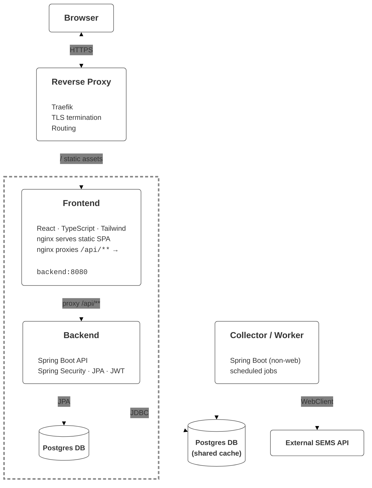

# HomeWatts — PV Analytics Platform

A portfolio project that demonstrates end-to-end engineering: data ingestion, secure APIs, a modern SPA, and production-grade DevOps. HomeWatts analyzes photovoltaic (PV) system data, normalizes it into a PostgreSQL model, and serves real-time + historical insights in a React dashboard. The project is built to showcase architecture decisions, security hardening, and automated delivery.


[](https://sonarcloud.io/dashboard?id=MarkusDunkel_homewatts)
[](https://sonarcloud.io/dashboard?id=MarkusDunkel_homewatts)

## Why this project exists
- **Webanwendung zur Analyse von Heim-Photovoltaik-Daten** (PV-Daten in Echtzeit + Historie)
- **Architektur und Implementierung mit Spring Boot (Backend) und React (Frontend)**
- **Sicherer Demo-Zugriff**: signierte Tokens, Rate-Limiting, Audit-Logging
- **CI-Pipeline** mit automatisierten Tests, JaCoCo-Coverage & SonarCloud-Quality-Gates
- **Gestufte Deployments** mit versionierten Docker-Images via GitHub Actions

## What I’m showcasing
- **System design**: decoupled API + worker services with clear boundaries and scaling paths.
- **Security-first API design**: JWT-based sessions, refresh-token rotation, demo access controls.
- **Operational excellence**: containerized services, infrastructure automation, and observability hooks.
- **Frontend craft**: polished UX, typed APIs, reusable UI primitives, and data visualization.

## Infrastructure & Architecture


## Key Features (selected)
### Secure demo access
- Signed demo tokens and rate-limited redemption for frictionless trials.
- Audit logging of all demo activations.
- Demo users inherit roles and are clearly identified in the UI.

### Data ingestion and analytics
- Dedicated **collector/worker** profile to ingest SEMS data on schedules.
- History + snapshot APIs for real-time and trending analytics.
- Separation of ingestion and API services for scaling and isolation.

### Frontend experience
- React + TypeScript SPA with responsive UI and data-rich dashboards.
- Recharts-powered visualizations for PV generation, load, and storage.
- Clean routing for authenticated, demo, and error experiences.

## Tech Stack
**Backend**
- Java 17, Spring Boot 3 (Web, Security, Data JPA, Validation, Actuator, WebFlux)
- PostgreSQL 15, Flyway, Resilience4j, Auth0 JWT
- Rate limiting: Bucket4j + Caffeine

**Frontend**
- React 18, TypeScript, Vite, TailwindCSS
- Zustand, React Router, Axios, Recharts, shadcn/ui

**Ops**
- Docker Compose + Traefik (TLS termination & routing)
- Nginx for SPA hosting and API proxying
- GitHub Actions, JaCoCo, SonarCloud
- Artifact Registry + GCE deployment playbook

## CI/CD & Quality
- Automated checks on pull requests.
- JaCoCo coverage reporting and SonarCloud quality gates.
- Versioned Docker images pushed via GitHub Actions workflows.
- Multi-stage deployment workflows (staging → production).

## Running locally
> Quick start (full stack via Docker):
```
docker compose up --build
```

Manual dev workflow:
- `backend/`: `mvn spring-boot:run`
- `frontend/`: `npm install && npm run dev`

## Project layout
```
├── backend/                # Spring Boot API + collector profile
├── frontend/               # Vite + React SPA
├── infrastructure/         # Deployment runbooks & infra notes
├── docker-compose.yml      # Traefik, API, worker, frontend, Postgres
└── README.md               # You are here
```

## Contact
If you’re looking for a developer who can design, build, and ship full-stack systems with production rigor, feel free to reach out.
