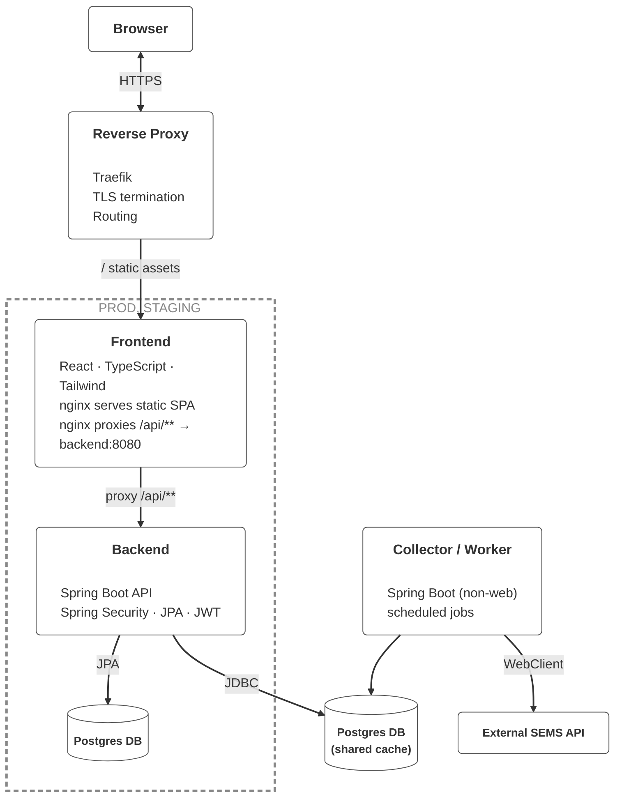

# HomeWatts — PV Analytics Platform

HomeWatts is a web-based analytics platform for residential photovoltaic (PV) systems.  
It ingests production and consumption data from external PV APIs, normalizes it into a relational data model, and exposes real-time and historical insights through a modern web dashboard.

In addition, HomeWatts includes an optimization tool that estimates the ideal PV system size to maximize long-term energy savings based on local economic conditions and climate factors.

The system is designed as a production-ready application with clear service boundaries, secure APIs, automated deployments, and a responsive single-page frontend.


[](https://sonarcloud.io/dashboard?id=MarkusDunkel_homewatts)
[](https://sonarcloud.io/dashboard?id=MarkusDunkel_homewatts)

For information visit [homewatts.xyz](https://homewatts.xyz).

## Project Purpose

The goal of HomeWatts is to provide a reliable and extensible foundation for analyzing residential PV system data, including:

- Collection of PV generation and consumption metrics from external provider APIs
- Secure access to normalized, queryable data through a REST API
- Visualization of live and historical data in a browser-based dashboard
- Estimation of optimal PV system sizing based on economic and climate parameters
- Clear separation of ingestion, API, and frontend concerns for operational clarity

The project reflects real-world constraints such as authentication, rate limiting, data consistency, and environment-specific deployments.

## Scope & Capabilities

- **Data ingestion** via a dedicated worker service with scheduled jobs  
- **Analytics and visualization** through a React + TypeScript single-page application  
- **Operational setup** with containerized services, TLS termination, and CI/CD

## Infrastructure & Architecture

A reverse proxy (Traefik) handles TLS termination and routing. The browser accesses a React/TypeScript SPA via HTTPS, which is delivered as a static application by nginx. API requests (/api/**) are forwarded from the frontend to a Spring Boot backend API, which encapsulates authentication (JWT), business logic, and persistence via JPA on a PostgreSQL database.

Both the production and staging data storage as well as the database shown as a cache are technically based on the same PostgreSQL database instance, which is operated within a single Docker container. These are not separate databases, but rather one shared database that is used differently on a logical level.

The visual separation in the diagram serves exclusively as a matter of emphasis: the data for PROD and STAGING is treated and managed as distinct functional environments, while the caching usage is independent of them. A separate Spring Boot worker executes scheduled jobs, calls the external SEMS API, and writes the results into this shared database.

This architectural decision pursues two goals: first, the SEMS API only allows retrieval of the current values. Since the worker runs as an independent service, no data gaps occur when the rest of the application is updated or restarted. Second, the SEMS API is unstable under a high number of concurrent requests. By centrally collecting and bundling requests, all environments are supplied efficiently while reducing load on the external interface.

## Key Features (selected)
### Secure demo access
- Signed demo tokens and rate-limited redemption for frictionless trials.
- Audit logging of all demo activations.
- Demo users inherit roles and are clearly identified in the UI.

### Data ingestion and analytics
- Dedicated **collector/worker** profile to ingest SEMS data on schedules.
- History + snapshot APIs for real-time and trending analytics.
- Separation of ingestion and API services for scaling and isolation.

### Frontend experience
- React + TypeScript SPA with responsive UI and data-rich dashboards.
- Recharts-powered visualizations for PV generation, load, and storage.
- Clean routing for authenticated, demo, and error experiences.

## Tech Stack
**Backend**
- Java 17, Spring Boot 3 (Web, Security, Data JPA, Validation, Actuator, WebFlux)
- PostgreSQL 15, Flyway, Resilience4j, Auth0 JWT
- Rate limiting: Bucket4j + Caffeine

**Frontend**
- React 18, TypeScript, Vite, TailwindCSS
- Zustand, React Router, Axios, Recharts, shadcn/ui

**Ops**
- Docker Compose + Traefik (TLS termination & routing)
- Nginx for SPA hosting and API proxying
- GitHub Actions, JaCoCo, SonarCloud
- Artifact Registry + GCE deployment playbook

## CI/CD & Quality
- Automated checks on pull requests.
- JaCoCo coverage reporting and SonarCloud quality gates.
- Versioned Docker images pushed via GitHub Actions workflows.
- Multi-stage deployment workflows (staging → production).

## Running locally
> Quick start (full stack via Docker):
```
docker compose up --build
```

Manual dev workflow:
- `backend/`: `mvn spring-boot:run`
- `frontend/`: `npm install && npm run dev`

## Project layout
```
├── backend/                # Spring Boot API + collector profile
├── frontend/               # Vite + React SPA
├── infrastructure/         # Deployment runbooks & infra notes
├── docker-compose.yml      # Traefik, API, worker, frontend, Postgres
└── README.md               # You are here
```

## Contact
Interested in the architecture or implementation of HomeWatts?
Questions, feedback, constructive criticism, and requests for demo access are welcome. Feel free to reach out to discuss the project or related full-stack development work.

